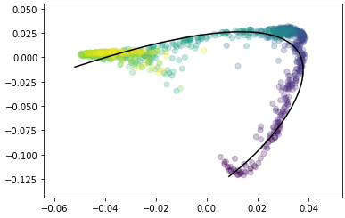

# pcurvepy
### Principal curves implementation (Hastie '89) in Python

Installation:
```
pip install pcurvepy
```

Example:
```python
import pandas as pd
import matplotlib as mp
import matplotlib.pyplot as plt
import pcurve

data = pd.read_csv('test_data.csv')
x = data.loc[:, ('X1', 'X2')].to_numpy()

# transform data to have zero mean
x = x - np.mean(x, 0)
index = np.arange(0, len(x))

p = pcurve.PrincipalCurve(k = 5)
p.fit(x)

plt.scatter(x[:, 0], x[:, 1], alpha = 0.25, c = index)
plt.plot(p.p[:, 0], p.p[:, 1], c = 'k')

```


